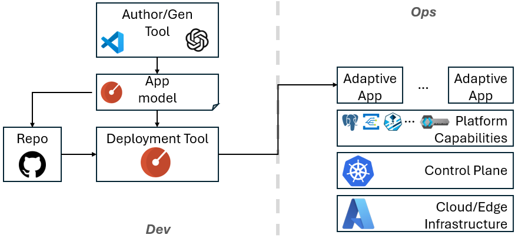

# Adaptive Apps

*Build once, Adapt everywhere.*

Adaptive Apps redefine how applications are built and operated by enabling them to move effortlessly across cloud, edge, and hybrid environments without re-architecture or lock-in.

## Value Proposition

* **Enable sovereign, multi-cloud, and isolated edge deployments**

    Meet regulatory, geopolitical, and operational requirements while maintaining a single application model.

* **Unlock existing investments by modernizing brownfield applications**

    Extend the life and value of legacy systems by making them portable, adaptable, and future-ready.

* **Bridge AI-native agentic systems with traditional microservices**

    Create a unified platform where emerging AI-driven workflows and established enterprise services operate together seamlessly.

## Architecture

Adaptive Apps is comprised of four layers: application model, programming model, application platform and AI-powered tooling. Rather than redefining these concepts from the ground up, Adaptive Apps leverage proven open-source and cloud-native technologies, such as [Radius](https://docs.radapp.io/), [Dapr](https://dapr.io/), and Azure Arc, and orchestrate them into an end-to-end solution.

    

### **Platform-agnostic application model**

Adaptive Apps use [Radius](https://docs.radapp.io/) as the application model.

A Radius application is composed of multiple resources, where each resource type can be deployed to supported environments using environment-specific recipes. This provides a clean and extensible abstraction for describing platform-agnostic applications.

Radius resource types are extensible, allowing Adaptive Apps to introduce new concepts such as AI agents alongside existing core resource types like compute and storage.

### **Platform-agnostic programming model**

For an application to be truly portable, its code must avoid direct dependencies on platform-specific APIs.

[Dapr](https://dapr.io/) provides this abstraction through a sidecar model that exposes platform capabilities, such as state management, messaging, and pub/sub, behind stable, portable APIs. Adaptive Apps support Dapr as the preferred programming model for new applications. In addition, Adaptive Apps provide AI-powered refactoring tools to help uplift brownfield applications by incrementally introducing the Dapr programming model.

> **NOTE**: Using Dapr is not mandatory. When sufficient platform parity exists across target environments, applications may bind directly to platform-specific APIs. For example, if all required services are available across Azure and Azure Arc, an application written against Azure APIs can remain portable within that scope.

### **Adaptive application platform**

The Adaptive Application Platform provides the runtime capabilities required by Adaptive Apps, including compute, storage, messaging, networking, observability, and AI services.

### AI-powered tooling

Adaptive Apps adopt and extend AI-enabled tools to simplify adoption and modernization.

As an initial capability, Adaptive Apps provide AI-based refactoring tools that assist in transforming legacy applications to adopt the Dapr programming model and portability patterns.

## Capability Portfolios

Delivering a consistent set of platform capabilities across cloud and edge environments is challenging due to differences in software availability, compatibility, and resource constraints.

To enable predictable portability, Adaptive Apps introduce the concept of a **capability portfolio**, which is a well-defined set of capabilities that an environment must provide in order to host a Adaptive App.

An application targets a specific capability portfolio and can be deployed to any environment that implements that portfolio.

A horiztonal comparison of portfolios is available [here](./docs/portfolios/overview.md).

### **Defined portfolios**

As a starting point, we define six portfolios, as summarized in the following table:

| Portfolio | Identity | Service mesh (Istio) | Observability | Governance (OPA) | On-cluster AI (Kaito) |
| --- | :-: | :-: | :-: | :-: | :-: |
| [`min`](./docs/portfolios/min.md) | ✓ | ✗ | ✗ | ✗ | ✗ |
| [`core`](./docs/portfolios/core.md) | ✓ | ✓ | ✓ | ✗ | ✗ |
| [`ent`](./docs/portfolios/ent.md) | ✓ | ✓ | ✓ | ✓ (off by default) | ✗ |
| [`min-ai`](./docs/portfolios/min-ai.md) | ✓ | ✗ | ✗ | ✗ | ✓ |
| [`core-ai`](./docs/portfolios/core-ai.md) | ✓ | ✓ | ✓ | ✗ | ✓ |
| [`ent-ai`](./docs/portfolios/ent-ai.md) | ✓ | ✓ | ✓ | ✓ (off by default) | ✓ |

* **`min`** — baseline hosting (identity + service hosting). Ideal for PoC,
  MVP, hackathon, demos and experiments.
* **`core`** — builds on `min` with operational readiness: service mesh, data
  sync, observability, basic policy enforcement, secret management. Ideal for
  standard production workloads.
* **`ent`** — builds on `core` for large-scale enterprise: advanced policy
  enforcement, advanced certificate management, advanced monitoring,
  backup/restore.
* **`*-ai`** — layer on-cluster AI model management onto the base portfolio
  for offline / local inference.

### **Capability portfolio deployment**

Adaptive Apps don't assume a specific control plane that operates the applications. A capability vendor is free to choose the most appropriate packaging and delivery mechanism to bootstrap a portfolio, including:

* Helm charts for Kubernetes environments
* Azure Arc extensions
* Azure Bicep templates
* Terraform templates

As long as the portfolio satisfies the capability contract, applications remain portable.

### **Third-part capability vendors**

Adaptive Apps enable third-party vendors to implement and deliver capability portfolios on cloud, edge, or specialized environments. As long as a portfolio exposes the required capabilities and APIs, any Adaptive App targeting that portfolio can be deployed without modification.

To support the Radius application model, capability vendors are expected to implement the necessary Radius recipes for deployment.

## Getting Started

Follow our [Getting Started tutorial](./tutorials/getting-started/README.md) to
deploy an Adaptive App portfolio on local Kubernetes, AKS, Azure Local, or Azure Arc.

### Additional tutorials

* [Generate Radius artifacts with the `ada` CLI](./tutorials/cli/README.md) — turn a `docker-compose.yml` into an `app.bicep`, comparing the `compose`, `llm`, and `skill` strategies and the critic loop.
* [Governance](./tutorials/governance/README.md) — author `AuthorizationPolicy` (native and OPA-delegated) for the `ent`/`ent-ai` portfolios.
* [Service mesh](./tutorials/service-mesh/README.md) — enroll the app namespace in Istio and verify mesh traffic.

## Topics

* [Agent Guardrails](./docs/agents/guard-rail.md)
* [Authentication](./docs/authentication/README.md)
* [Data Sync](./docs/data-sync/README.md)
* [Policies](./docs/policies/README.md)

