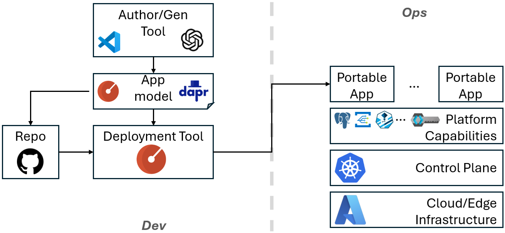

# Portable Apps

*Build once, Adapt everywhere.*

Portable Apps redefine how applications are built and operated by enabling them to move effortlessly across cloud, edge, and hybrid environments without re-architecture or lock-in.

## Value Proposition

* **Enable sovereign, multi-cloud, and isolated edge deployments**

    Meet regulatory, geopolitical, and operational requirements while maintaining a single application model.

* **Unlock existing investments by modernizing brownfield applications**

    Extend the life and value of legacy systems by making them portable, adaptable, and future-ready.

* **Bridge AI-native agentic systems with traditional microservices**

    Create a unified platform where emerging AI-driven workflows and established enterprise services operate together seamlessly.

## Architecture

Portable Apps is comprised of four layers:a pplication model, programming model, application platform and AI-powered tooling. Rather than redefining these concepts from the ground up, Portable Apps leverage proven open-source and cloud-native technologies, such as [Radius](https://docs.radapp.io/), [Dapr](https://dapr.io/), and Azure Arc, and orchestrate them into an end-to-end solution.



### **Platform-agnostic application model**

Portable Apps use [Radius](https://docs.radapp.io/) as the application model.

A Radius application is composed of multiple resources, where each resource type can be deployed to supported environments using environment-specific recipes. This provides a clean and extensible abstraction for describing platform-agnostic applications.

Radius resource types are extensible, allowing Portable Apps to introduce new concepts such as AI agents alongside existing core resource types like compute and storage.

### **Platform-agnostic programming model**

For an application to be truly portable, its code must avoid direct dependencies on platform-specific APIs.

[Dapr](https://dapr.io/) provides this abstraction through a sidecar model that exposes platform capabilities, such as state management, messaging, and pub/sub, behind stable, portable APIs. Portable Apps support Dapr as the preferred programming model for new applications. In addition, Portable Apps provide AI-powered refactoring tools to help uplift brownfield applications by incrementally introducing the Dapr programming model.

> **NOTE**: Using Dapr is not mandatory. When sufficient platform parity exists across target environments, applications may bind directly to platform-specific APIs. For example, if all required services are available across Azure and Azure Arc, an application written against Azure APIs can remain portable within that scope.

### **Portable application platform**

The Portable Application Platform provides the runtime capabilities required by Portable Apps, including compute, storage, messaging, networking, observability, and AI services.

#### Capability Portfolios

Delivering a consistent set of platform capabilities across cloud and edge environments is challenging due to differences in software availability, compatibility, and resource constraints.

To enable predictable portability, Portable Apps introduce the concept of a **capability portfolio**, which is a well-defined set of capabilities that an environment must provide in order to host a Portable App.

An application targets a specific capability portfolio and can be deployed to any environment that implements that portfolio.

#### **Defined portfolios**

As a starting point, we define four portfolios:

*  `azure-compute-core` 
    
    Core capabilities based on generally available Azure and Azure Arc services.

* `azure-compute-ext`

    Extends `azure-compute-core` with additional services.

* `dapr-compute` 
    
    Core Dap runtime capabilities.

*  `dapr-ai` 

    Full Dapr runtime, including agentic and AI-driven capabilities.

The following table provides details of these capability portfolios:

|Capability| Radius Resource Type | `azure-compute` | `dapr-compute` | `dapr-ai` |
|--------|--------|--------|--------|--------|
| Compute | - | Azure ACI | K8s native deployments|
| Agent | - | - | - |

#### **Capability portfolio deployment**

Portable Apps don't assume a specific control plane that operates the applications. A capability vendor is free to choose the most appropriate packaging and delivery mechanism to bootstrap a portfolio, including:

* Helm charts for Kubernetes environments
* Azure Arc extensions
* Azure Bicep templates

As long as the portfolio satisfies the capability contract, applications remain portable.

#### **Third-part capability vendors**

Portable Apps enable third-party vendors to implement and deliver capability portfolios on cloud, edge, or specialized environments. As long as a portfolio exposes the required capabilities and APIs, any Portable App targeting that portfolio can be deployed without modification.

To support the Radius application model, capability vendors are expected to implement the necessary Radius recipes for deployment.

### **AI-powered tooling**

Portable Apps adopt and extend AI-enabled tools to simplify adoption and modernization.

As an initial capability, Portable Apps provide AI-based refactoring tools that assist in transforming legacy applications to adopt the Dapr programming model and portability patterns.

## Getting Started

Follow our [getting-started tutorial](./tutorials/getting-started/README.md) to deploy a Portable App across cloud and edge environments.

## Kaito on WSL2 / k3s — Setup Notes

The following notes capture the steps required to run the [Kaito](https://github.com/kaito-project/kaito) AI model operator on a local **k3s** cluster under **WSL2** with a single NVIDIA GPU (tested with an RTX A2000 Laptop, 4 GB VRAM).

### 1. Upgrade Kaito to v0.9.0

v0.9.0 adds support for generic HuggingFace model IDs (e.g. `Qwen/Qwen3-0.6B`) via vLLM.

```bash
helm repo update
helm upgrade kaito-workspace kaito/workspace \
  --version 0.9.0 \
  --namespace kaito-workspace \
  --set featureGates.disableNodeAutoProvisioning=true \
  --set nvidiaDevicePlugin.enabled=false \
  --set localCSIDriver.useLocalCSIDriver=false
```

> `nvidiaDevicePlugin.enabled=false` avoids conflict with an existing device-plugin DaemonSet.
> `disableNodeAutoProvisioning=true` is required for BYO GPU mode (note: the flag changed to lowercase `d` in v0.9.0).

### 2. NVIDIA container runtime

k3s registers the `nvidia` runtime but does **not** use it by default. Kaito's StatefulSet is created with the default `runc` runtime, which does not mount the NVIDIA driver libraries into containers (NVML Shared Library Not Found).

**Option A — Patch the StatefulSet after Kaito creates it:**

```bash
kubectl patch statefulset <workspace-name> --type='json' \
  -p='[{"op":"add","path":"/spec/template/spec/runtimeClassName","value":"nvidia"}]'
```

**Option B (recommended) — Make `nvidia` the default containerd runtime.** This is the permanent fix — every container on the node will use the NVIDIA runtime automatically, so no patching is needed after `rad deploy` or Kaito reconciliation.

> **Important:** `config.toml.tmpl` **replaces** the entire k3s containerd config.
> You must start from the full generated config, not an empty file.

```bash
# 1. Copy the full k3s-generated config as the template base
sudo cp /var/lib/rancher/k3s/agent/etc/containerd/config.toml \
        /var/lib/rancher/k3s/agent/etc/containerd/config.toml.tmpl

# 2. Add default_runtime_name = "nvidia" under the containerd section
sudo sed -i "/\[plugins.'io.containerd.cri.v1.runtime'.containerd.runtimes.runc\]/i\\
[plugins.'io.containerd.cri.v1.runtime'.containerd]\\
  default_runtime_name = \"nvidia\"\\
" /var/lib/rancher/k3s/agent/etc/containerd/config.toml.tmpl

# 3. Restart k3s
sudo systemctl restart k3s
```

Verify the node comes back Ready:
```bash
kubectl get nodes
```

### 3. GPU node labels

Kaito's node estimator reads the `nvidia.com/gpu.memory` label to calculate how many nodes are needed. WSL2 GPU Feature Discovery may not auto-populate all labels. Ensure the node has at least:

```bash
kubectl label node <node> nvidia.com/gpu=true          # Kaito labelSelector
kubectl label node <node> nvidia.com/gpu.memory=<MiB>  # Used by the estimator
```

### 4. vLLM parameters for small-VRAM GPUs

The inference ConfigMap needs these settings for GPUs with ≤ 4 GB VRAM:

```yaml
apiVersion: v1
kind: ConfigMap
metadata:
  name: <workspace>-inference-params
data:
  inference_config.yaml: |
    vllm:
      max-model-len: 2048            # Limit context length
      gpu-memory-utilization: 0.75   # WSL2 reserves ~0.8 GiB for the display driver
      enforce-eager: true            # Triton/torch.compile fails on WSL2
```

Reference the ConfigMap from the Workspace:

```yaml
inference:
  preset:
    name: Qwen/Qwen3-0.6B
  config: <workspace>-inference-params
```

### 5. Known issues (Kaito v0.9.0)

| Issue | Workaround |
|-------|-----------|
| Webhook panic (`MustParse("")`) when applying a generic-model Workspace in BYO mode | Delete the validating webhook before applying: `kubectl delete validatingwebhookconfiguration kaito-workspace-validating-webhook` |
| Node estimator ignores `max-model-len` from ConfigMap and over-estimates `targetNodeCount` | Inflate the `nvidia.com/gpu.memory` node label to satisfy the estimator |

See [src/ai-agent/kaito-workspace.yaml](./src/ai-agent/kaito-workspace.yaml) for a complete standalone example.