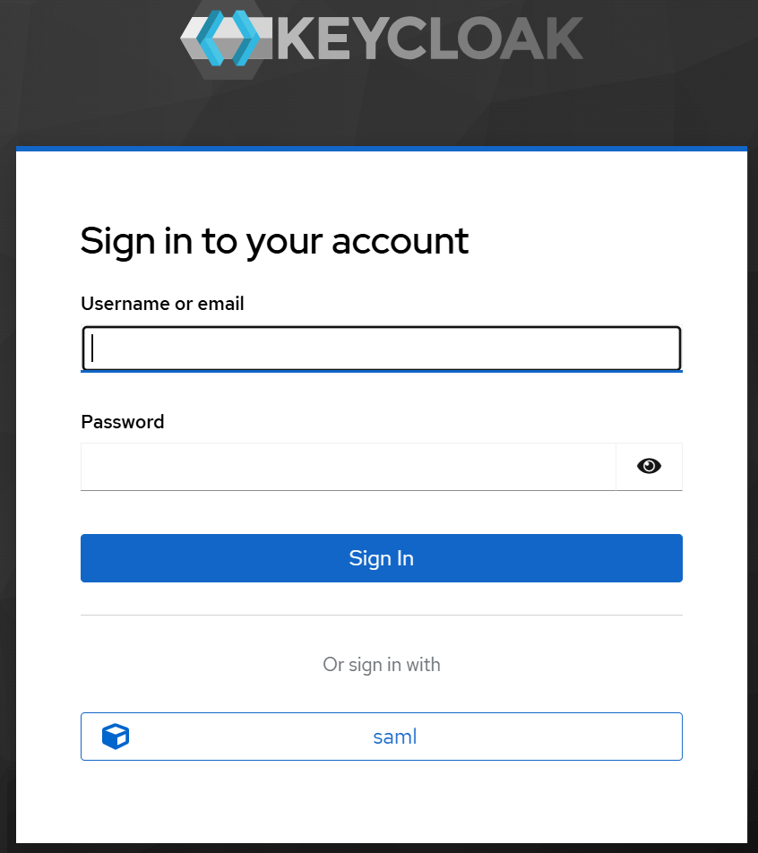

# KeyCloak federation with Azure Entra ID

## Deploy KeyCloak

You can deploy KeyCloak by installing one of the Adaptive Apps capability portfolios. Once an Adaptive App capability profile is deployed, you can acess KeyCloak portal locally by:

1. Port forward to KeyCloak portal

    ```bash
    kubectl port-forward -n min svc/min-keycloak 8080:8080
    ```

2. Open `http://localhost:8080` and sign in with the chart values:

    - username: `admin`
    - password: `admin`

    Then, you can use KeyCloak portal to manage users and credentials.

3. Collect KeyCloak SAML endpoint. Visit the http://localhost:8080/realms/master/protocol/saml/descriptor page and note down:

    - `entityID` of the root element, i.e., `http://localhost:8080/realms/master`.
    - `Location` of the `md:ArtifactResolutionService` element, i.e., `http://localhost:8080/realms/master/protocol/saml/resolve`.

## Creating an Enterprise Application in Azure Entra ID

1. Sign in to [Microsoft Entra admin center](https://entra.microsoft.com/).
2. Click on **Enterprise apps** in the left pane and click on **New application**.
3. CLick on **Create your own application**.
4. Enter an application name, and select the **Integrate any other application you don't find in the gallery (Non-gallery)** option. Click the **Create** button to create the application.
5. You are now on application overview page. Click the **Signle sign-on** link in the left pane.
6. Click on the **SAML** tile.
7. Edit the **Basic SAML Configuration** and enter these fields:

    - **Identifier (Entity ID)**: the `entityID` attribute from the KeyCloak SAML
    - **Reply URL**: the `Location` attribute from the KeyCloak SAML.
    - Add a secondary **Reply URL** with `/resolve` replaced with `endpoint`, i.e., `http://localhost:8080/realms/master/protocol/saml/endpoint`.
    - **Logout Url (Optional)**: This will be `entityID` with a `protocol/saml` post-fix, i.e., `http://localhost:8080/realms/master/protocol/saml`. This Url is required to use `https`. You can omit it for now.

    Click **Save** to save changes.
8. Scroll to the **SAML Certificates** section and download **Federation Metadata XML**.

## Assign users and groups
1. Still on the application overview page, click on **Users and groups** link in the left pane.
2. Click on **Add user/group**
2. Add the user(s) you want to assign and assign the users.

## Configure Entra ID as an IdP in KeyCloak
1. Back to the KeyCloak portal, click on the **Identity providers** link in the left pane.
2. Click on the **SAML v2.0** tile.
3. Enter a **Display name**.
4. Turn **Use entity descriptor** to **Off**.
5. In **Import config from file** field, click on the **Browse** button and select the federation metadata XML you've downloaded earlier.
6. Click on the **Add** button.
7. Back in identity provider settings, set **Sync mode** to **Force** (instead of **Import**). This is not strictly needed. But as you experiment with different configuration, this setting forces user profile to be updated at each login. This ensures you see the result of latest configurations (such as mappings).
6. Click on the **Save** button.
7. Go to **Mappers** tab, and add a few attribute mappers:

    * **Sync mode override**: Inherit
    * **Mapper type**: Attribute Importer
    * **Name Format**: ATTRIBUTE_FORMAT_BASIC

    | Name |  Attribute Name | User Attribute Name |
    |--------|--------|--------|
    | email | http://schemas.xmlsoap.org/ws/2005/05/identity/claims/emailaddress | email |
    | firstName | http://schemas.xmlsoap.org/ws/2005/05/identity/claims/givenname | firstName | 
    | lastName | http://schemas.xmlsoap.org/ws/2005/05/identity/claims/surname | lastName |

8. Click on the **Save** button.

## Log in using Azure Entra ID
Once you have the federated IdP configured, you should see an additional option when you are directed to the KeyCloak login page:

<p align="center">
    
</p>

Click on the **saml** button to log in using your Entra ID credential.

> **NOTE**: The name **saml** is your IdP Name in KeyCloak. If you choose to use a different name, the Replay URL needs to match with the new name.