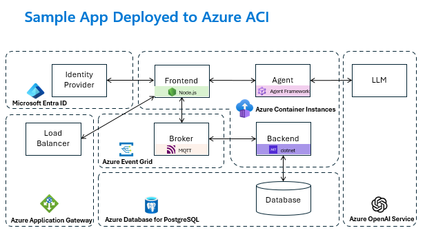
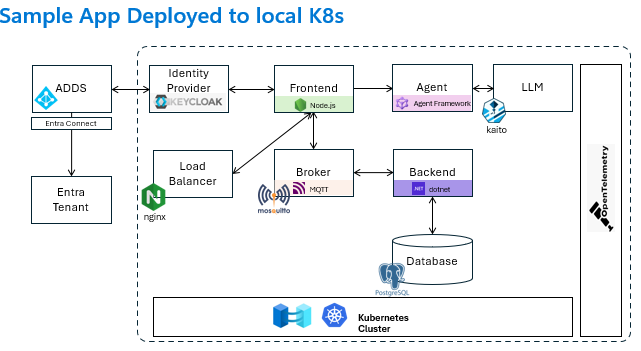

# Challenge 06 - Adapt Identity Services - Configure User Authentication - Coach's Guide

[< Previous Solution](./Solution-05.md) - **[Home](./README.md)** - [Next Solution >](./Solution-07.md)

## Challenge Overview for Coaches

Challenge 06 moves from "portable infrastructure" to "portable identity". Teams keep the same application model and attach the frontend login path to different upstream identity systems per environment:

- `env-azure-prod`: Keycloak federated to Microsoft Entra ID
- `env-local-prod`: Keycloak federated to local AD DS (LDAP)

The architectural pattern remains stable: the frontend authenticates through OIDC, Keycloak is the broker, and upstream identity differs by environment.

If the workshop uses the optional two-AKS fallback and no AD DS is available, keep the same learning objective by using a coach-approved substitute for the local upstream identity provider: Keycloak local users, a second Entra application/tenant, or another lightweight OIDC/LDAP provider. Do not describe that path as Azure Local; describe it as a lab stand-in for environment-specific identity plumbing.

### Intended learning outcomes

- Understand how Keycloak acts as an identity broker while preserving a stable app OIDC contract.
- Configure one OIDC client for the frontend and reuse it across environments.
- Configure different upstream IdPs (Entra vs AD DS) without rewriting the application.
- Validate identity behavior with environment-aware checks.

### Technologies practiced

- Keycloak (OIDC client + identity federation)
- Microsoft Entra ID (SAML federation with Keycloak)
- Active Directory Domain Services (LDAP federation with Keycloak)
- Radius environment targeting (`env-azure-prod`, `env-local-prod`)

## Learning Objectives Breakdown

| Task | Skill Developed | Concept Reinforced | Expected Participant Outcome |
|---|---|---|---|
| Create OIDC client in Keycloak | IdP client setup | Stable app auth contract | Frontend has valid OIDC client ID/secret and endpoints |
| Configure Entra federation (azure) | Enterprise IdP integration | Brokered identity | User can sign in via Entra through Keycloak |
| Configure AD DS federation (local) | LDAP integration | Hybrid identity | User can sign in with AD DS users through Keycloak |
| Validate both envs | Troubleshooting + verification | Portability boundary | Team proves same app identity flow with different upstream IdPs |

## Expected Solution Approaches (High-Level)

- Approach A: Configure both environments with the same Keycloak client (`adaptive-apps`), change only upstream identity provider setup.
- Approach B: Keep one stable frontend OIDC configuration and use Keycloak routing/buttons to choose upstream provider.
- Approach C: Use environment-specific Keycloak instances but keep identical client settings and frontend environment variables.

All are valid if the frontend OIDC integration remains unchanged and login works in both target environments.

## Key Concepts and Teaching Points

- Identity broker pattern: Keycloak isolates the app from upstream identity differences.
- Portability boundary: app config stays stable; environment identity plumbing changes.
- Protocol bridging: OIDC for app login, SAML/LDAP federation upstream.
- Operational continuity: local AD path supports disconnected/local scenarios; Entra path supports cloud identity governance.

## Common Pitfalls and Misconceptions

- Confusing app OIDC client with upstream IdP config.
- Using incorrect redirect URI (must include `http://localhost:3000/*` for local frontend testing).
- Exporting OIDC endpoints from one namespace/release but deploying in another.
- Forgetting to assign Entra users/groups to the enterprise application.
- LDAP TLS/certificate mismatch in AD DS federation (`ldaps://...:636` subject mismatch).

## Coaching Guidance (Socratic Questions)

- "What identity settings should stay constant between `env-azure-prod` and `env-local-prod`?"
- "Which part of this flow is app-owned versus environment-owned?"
- "If login fails, how would you isolate whether the issue is OIDC client, federation, or user assignment?"
- "What trade-off are you making by brokering all login through Keycloak?"
- "How does this design help if one upstream provider is unavailable?"

## Hint Strategy Guidance

- First hint: ask teams to draw the auth sequence (frontend -> Keycloak -> upstream IdP).
- Second hint: nudge teams to validate OIDC client settings before debugging federation.
- Third hint: point to upstream provider checks (Entra app assignment or AD LDAP connection test).
- Final hint: provide exact command/UI location only when teams are blocked after demonstrating troubleshooting attempts.

## Validation Guidance

A correct implementation should demonstrate:

- Frontend redirects to Keycloak for authentication.
- Keycloak OIDC client exists with working redirect URI and secret.
- `env-azure-prod` login can use Entra-federated identity.
- `env-local-prod` login can use AD DS-federated identity.
- The app model remains unchanged between both deployments.

Acceptable variations:

- Different Keycloak IdP display names and mapper naming.
- Different workspace/group naming, if used consistently.
- Different test users, as long as authentication path is verifiable end-to-end.
- For the optional two-AKS fallback, a local identity substitute instead of AD DS, if coaches explicitly call out the limitation.

## Optional Demo and Discussion Points

- Compare token claims from Entra-federated login vs AD-federated login.
- Discuss break-glass identity options when cloud identity is degraded.
- Whiteboard where to enforce authorization: app claims, Keycloak mappers, or policy layer.

---

## Solution Guide

### Architecture Explanation (Use the two pasted diagrams)

Use the two diagrams in the challenge brief to anchor the story:

- **Sample App Deployed to Azure ACI**: emphasize that frontend auth uses Keycloak-brokered identity with Entra as upstream IdP in `env-azure-prod`.



- **Sample App Deployed to local K8s**: emphasize that frontend auth uses the same OIDC contract, but Keycloak federates to AD DS in `env-local-prod`.



Coach framing: the boxes and arrows change at the identity-provider edge, not at the frontend OIDC integration point.

### Stage 1 - Confirm target environments

```bash
rad workspace switch ws-local-prod
rad group switch rg-trading
rad env show env-local-prod

rad workspace switch ws-azure-prod
rad group switch rg-trading
rad env show env-azure-prod
```

### Stage 2 - Create an OIDC client in Keycloak

Open Keycloak and create the OIDC client the sample app will use:

```bash
export PORTFOLIO=min
export KEYCLOAK_RELEASE=$PORTFOLIO
export KEYCLOAK_NAMESPACE=$PORTFOLIO

kubectl port-forward -n "$KEYCLOAK_NAMESPACE" "svc/${KEYCLOAK_RELEASE}-keycloak" 8080:8080
```

In another terminal, open <http://localhost:8080>, log in as `admin` / `admin`
(or whatever you set in `keycloak.admin.*`), then under realm `master`:

1. **Clients -> Create client**
  - `Client type`: OpenID Connect
  - `Client ID`: `adaptive-apps`
2. **Capability config**
  - `Client authentication`: **On**
  - `Standard flow`: enabled
3. **Login settings**
  - `Valid redirect URIs`: `http://localhost:3000/*`
4. Save, then go to the **Credentials** tab and copy the client secret.

Export the OIDC environment variables:

```bash
export OIDC_CLIENT_ID=adaptive-apps
export OIDC_CLIENT_SECRET=<paste-from-credentials-tab>
export OIDC_ISSUER=http://${KEYCLOAK_RELEASE}-keycloak.${KEYCLOAK_NAMESPACE}.svc.cluster.local:8080/realms/master
export OIDC_AUTH_ENDPOINT=$OIDC_ISSUER/protocol/openid-connect/auth
export OIDC_TOKEN_ENDPOINT=$OIDC_ISSUER/protocol/openid-connect/token
export OIDC_USERINFO_ENDPOINT=$OIDC_ISSUER/protocol/openid-connect/userinfo
export OIDC_BROWSER_AUTH_ENDPOINT=http://localhost:8080/realms/master/protocol/openid-connect/auth
```

> Repeat this section for each environment's Keycloak instance if teams run separate clusters/namespaces.

> **Two-AKS fallback:** If there is no AD DS for `env-local-prod`, keep the frontend OIDC client contract identical and configure a simpler local upstream provider (for example Keycloak local users or a second Entra-backed IdP). The point is to prove environment-specific identity plumbing without changing the app.

### Stage 3 - Configure `env-azure-prod` for Entra federation

1. In Keycloak, capture SAML descriptor values from:
  - `http://localhost:8080/realms/master/protocol/saml/descriptor`
2. In Microsoft Entra admin center:
  - Create a non-gallery enterprise application.
  - Configure **Single sign-on** using **SAML**.
  - Set **Identifier (Entity ID)** and **Reply URL** from Keycloak descriptor.
  - Add secondary reply URL replacing `/resolve` with `/endpoint`.
  - Download **Federation Metadata XML**.
3. Back in Keycloak:
  - **Identity providers -> SAML v2.0**.
  - Import Entra metadata XML.
  - Save and set sync mode as needed.
  - Add mappers for `email`, `firstName`, `lastName`.
4. In Entra enterprise app:
  - Assign users/groups for test sign-in.

Validation for this stage:

- Keycloak login page shows the Entra SAML option.
- Assigned Entra users can authenticate and return to frontend flow.

### Stage 4 - Configure `env-local-prod` for AD DS federation

1. In Keycloak:
  - Go to **User federation** and add **LDAP** provider.
2. Configure LDAP connection:
  - `Connection URL`: `ldaps://<domain-controller-host>:636`
  - `Use Truststore SPI`: `Always`
  - `Connection pooling`: `On`
3. Configure bind credentials:
  - `Bind DN`: `CN=Administrator,CN=Users,DC=corp,DC=local`
  - `Bind credentials`: `<Administrator password>`
4. Configure search settings:
  - `Edit mode`: `READ_ONLY`
  - `Users DN`: `CN=Users,DC=corp,DC=local`
  - `Username LDAP attribute`: `sAMAccountName`
5. Save and run **Sync all users**.

Validation for this stage:

- LDAP connection test succeeds.
- AD users appear in Keycloak and can authenticate to frontend.

### Stage 5 - End-to-end checks in both environments

- Run frontend and open `http://localhost:3000`.
- Confirm redirect to Keycloak login.
- Validate login using Entra-backed user in `env-azure-prod`.
- Validate login using AD DS-backed user in `env-local-prod`.
- Confirm app code and OIDC client contract are unchanged across both environments.

### What coaches should listen for in debrief

- Teams can clearly separate app-level OIDC config from environment-level federation.
- Teams can explain why Keycloak makes identity provider substitution possible.
- Teams can identify where to troubleshoot first when login fails (client, federation, assignment, certificates).
