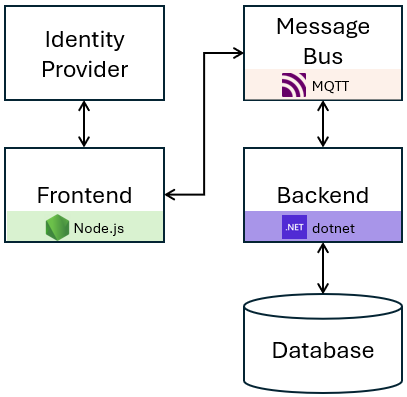

# Adaptive Apps Getting Started Tutorial

In this tutorial, you'll deploy a sample stock trading application across multiple environments, including Azure, Azure Arc, and a local Kubernetes cluster. The application consists of a frontend written in Node.js, a backend implemented in C#, a PostgreSQL database, and a message bus that enables communication between the frontend and backend. For authentication, the application uses an OIDC identity provider. 

    

The following table shows how each component is mapped to platform-specific deployment on different environment:

| Component | Azure | Azure Arc | Local K8s |
|--------|-------|-------|-------|
| Frontend |	Pod on Azure Kubernetes Service |	Pod on Arc-enabled Kubernetes cluster | Pod on local Kubernetes cluster |
| Backend |	Pod on Azure Kubernetes Service	| Pod on Arc-enabled Kubernetes cluster | Pod on local Kubernetes cluster |
| Identity | Provider	Microsoft Entra ID	| Microsoft Entra ID | Keycloak |
| Database |	Azure SQL Database	| SQL Managed Instance enabled by Azure Arc	| PostgreSQL (self-managed) |
| Messaging |	Azure Event Grid | Eclipse Mosquitto | Eclipse Mosquitto |

Follow the instructions for your chosen environment to deploy the app:

* Deploy to Azure
* Deploy to Azure Arc
* [Deploy to local Kubernetes](./deploy-to-k8s/README.md)