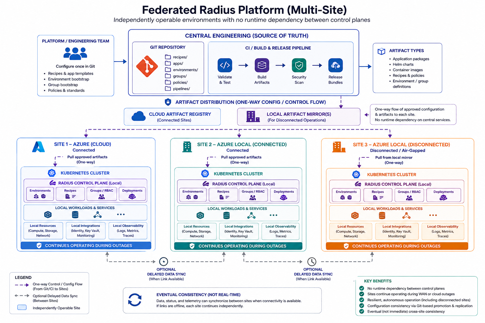
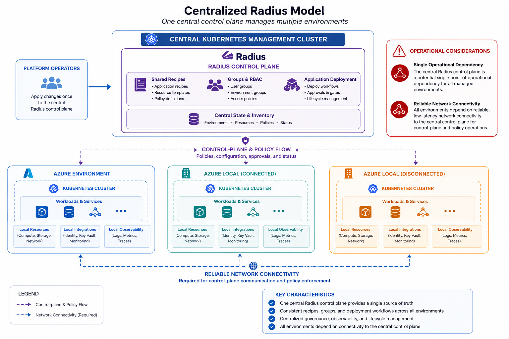

# Challenge 02 - Deploy and Explore Radius - Coach's Guide

[< Previous Solution](./Solution-01.md) - **[Home](./README.md)** - [Next Solution >](./Solution-03.md)

## Notes & Guidance

- The goal of this challenge is to install and configure Radius for your chosen deployment model.
- Before starting, teams should understand the two control-plane architectures (see "Control Plane Deployment Options" section below). This guide follows the federated model because it best supports the portability story across environments.
- For most multi-environment teams, the **Federated Model** (one control plane per site) provides better resilience for multi-site or disconnected scenarios.
- The **Centralized Model** (one shared control plane) is simpler operationally but requires reliable connectivity between all sites.
- Only one team member needs to run `rad install kubernetes` against a shared cluster. Each team member then sets up their own local workspace — that is per-workstation, not per-cluster.
- Typical blockers to watch for:
  - Mismatched `kubectl` context — teams sometimes install Radius into the wrong cluster. Have them run `kubectl config current-context` before `rad install kubernetes`.
  - Radius pod startup on first install can take 5–10 minutes. Tell teams to wait rather than re-running the installer.
  - `rad` CLI version mismatch with the control plane — always install the latest CLI and let `rad install kubernetes` pick the matching chart.
- The **Explore** part matters: teams should open the Radius dashboard, inspect the environment, and be able to describe what each control plane component does. Do not let teams skip this step and jump straight to recipes.
- Expected time to complete for a team: **30–45 minutes** per environment. Coach should wait ~15 minutes of apparent inactivity before stepping in.

## Solution Guide

### Control Plane Deployment Options

Before installing Radius, your team must choose between two architectural models. Both are valid; the choice depends on your resilience and operational requirements.

#### Model 1: Federated Control Planes (Recommended for Multi-Site / Disconnected)

**Overview:**
- One independent Radius control plane **per site** (Azure, Azure Local, Azure Local Disconnected, etc.).
- Each site operates autonomously. Network outages between sites do **not** block local operations.
- Shared configuration comes from Git-based synchronization, not from live runtime coupling.
- Best for edge, disconnected, or high-availability scenarios.

**Architecture Diagram:**



**Key characteristics:**
- Sites: Independent Kubernetes clusters, each with its own Radius control plane
- Config source: Central Git repo + CI/CD promotion pipeline
- Deployment: Each site applies artifacts independently
- Failure behavior: Site outage is isolated; others unaffected
- Data sync: Eventual consistency, handled separately (see [docs/data-sync/README.md](../../../docs/data-sync/README.md))

**When to choose this model:**
- You need to operate during cloud/WAN disconnection
- You want each site to be resilient and autonomous
- You accept eventual consistency for config and data
- You have teams managing different sites independently

#### Model 2: Centralized Control Plane (Recommended for Always-Connected)

**Overview:**
- One shared Radius control plane hosted in a management cluster.
- All environments (Azure, Azure Local, etc.) are managed centrally from that control plane.
- Requires reliable network connectivity between all sites and the central control plane.
- Best for tightly coordinated, always-on deployments.

**Architecture Diagram:**



**Key characteristics:**
- Sites: Multiple execution environments connected to one central control plane
- Config source: Direct API updates to the central control plane
- Deployment: Orchestrated from the center
- Failure behavior: Central control plane outage impacts all sites
- Policy: Centrally enforced across all environments

**When to choose this model:**
- All your environments are reliably connected
- You want centralized governance and policy
- You prefer operational simplicity over site autonomy
- You can accept a single control-plane dependency

#### Decision Framework

| Scenario | Recommended Model |
|----------|-------------------|
| Azure only, single region | **Centralized** (simpler) |
| Azure + Arc in one datacenter | **Centralized** (simpler) or **Federated** (more resilient) |
| Azure + Azure Local (connected) | **Federated** (better isolation) or **Centralized** (simpler) |
| Azure + Azure Local (intermittent connectivity) | **Federated** (only viable option) |
| Azure + Azure Local (disconnected/air-gapped) | **Federated** (only viable option) |
| Optional two-AKS workshop fallback | **Federated** (best preserves the learning objective) |
| Multiple sites across WAN | **Federated** (resilience) or **Centralized** (if connectivity is guaranteed) |

---

### This Challenge: Following the Federated Model

This challenge follows the **Federated Model** (one control plane per site). If your team wants the Centralized Model, coaches should treat it as an advanced variation and adapt the workspace/environment setup deliberately.

In the Federated Model:
1. Each site installs its own Radius control plane on its own cluster.
2. Each workstation creates one local `rad` workspace per control plane.
3. Each control plane creates its own environments and resource groups using the same naming conventions.
4. Configuration is synchronized via Git and CI/CD, not via live Radius APIs.
5. Data sync between sites is handled separately (see [docs/data-sync/README.md](../../../docs/data-sync/README.md)).

---

### Understanding the Radius Hierarchy

Before installing Radius, coaches should ensure the team understands the three-level hierarchy that Radius uses to organize workloads.

#### Radius Control Plane (one per site/cluster)

A **Radius control plane** is deployed once per Kubernetes cluster. It provides:
- API servers (`applications-rp`, `controller`)
- Bicep deployment engine (`bicep-de`)
- Unified Control Plane (`UCP`) for multi-tenancy and policy
- Dashboard for visualization
- CRDs for portable application models

Each cluster has its own control plane. In the Federated Model, Azure, Azure Local, and Azure Local Disconnected each have separate control planes.

#### Environments (organize by platform + stage)

A **Radius environment** is a named configuration that tells Radius *how* to deploy applications. Each environment encodes:
- The **Kubernetes namespace** where application workloads run
- An optional **cloud provider registration** (Azure subscription + resource group) for provisioning cloud-managed resources
- **Recipe registrations** that map portable resource types to platform-specific implementations

The same application (e.g., `app.bicep`) deployed to `env-azure-prod` and `env-local-prod` produces different infrastructure because each environment has different recipes and cloud provider settings.

**Recommended naming:** `env-<platform>-<stage>` (e.g., `env-azure-prod`, `env-local-disconnected-prod`)

#### Resource Groups (organize by domain/team)

A **Radius resource group** is a logical container for applications and other Radius resources within an environment, organized by domain or team. It is **not** an Azure resource group and has no Azure billing implications.

**Key points:**
- Create the same resource group names in each environment or control plane (`rg-trading` exists in both `env-azure-prod` and `env-local-prod`)
- Every Radius application must live in a resource group
- Switching with `rad group switch` changes the scope for all subsequent `rad` commands on that workstation

**Recommended naming:** `rg-<domain>` (e.g., `rg-finance`, `rg-trading`, `rg-sales`)

#### The Complete Hierarchy

```text
Workstation rad config
|
|-- Workspace: ws-azure-prod
|   `-- Azure Radius control plane
|       `-- Environment: env-azure-prod
|           `-- Resource Group: rg-trading
|               `-- Application: adaptive-apps
|
`-- Workspace: ws-local-prod
    `-- Local/edge Radius control plane
        `-- Environment: env-local-prod
            `-- Resource Group: rg-trading
                `-- Application: adaptive-apps
```

> **In this hack:** the reference application you deploy from Challenge 4 onward is a **single** Radius application named `adaptive-apps`, deployed into the `rg-trading` resource group in each environment. The same names appear under different workspaces/control planes so teams can compare environments without changing the application model.

#### Understanding Workspaces

A Radius **workspace** is a local, per-workstation CLI configuration that tells the `rad` CLI which Kubernetes cluster (and therefore which Radius control plane) to target. It lives in `~/.rad/config.yaml` — not in the cluster.

**Key points:**
- **One workspace = one cluster = one control plane**
- All environments on that cluster are reachable once the workspace is active; you switch between them with `rad env switch`
- Workspace names should match the cluster and site they represent

**Recommended naming:** `ws-<platform>-<stage>` (e.g., `ws-azure-prod`, `ws-local-prod`)

---

### Installation: Choose Your Environment

Pick **one or more** target environments and follow the corresponding guide. Each guide includes Radius control plane installation, environment creation, resource group setup, and validation:

| Environment | Guide | Notes |
|---|---|---|
| Local k3s (via k3d) | [`common/prepareRadius-k3s.md`](../../common/prepareRadius-k3s.md) | Lightweight, ideal for dev/testing |
| Azure Kubernetes Service (AKS) | [`common/prepareRadius-aks.md`](../../common/prepareRadius-aks.md) | Production-grade; integrates with ACR and Key Vault |
| Azure Arc-enabled cluster | [`common/prepareRadius-arc.md`](../../common/prepareRadius-arc.md) | On-premises, edge, or multi-cloud |
| Azure Local | [`common/prepareRadius-azure-local.md`](../../common/prepareRadius-azure-local.md) | Fully disconnected or intermittently connected |

For each environment you choose, follow the corresponding guide **in full**. The guide includes:
1. Radius control plane installation
2. Workspace and environment setup
3. Resource group creation
4. Validation checks
5. Optional dashboard exploration

---

### Multi-Site Deployment (Federated Model)

If you are deploying to multiple sites (e.g., Azure + Azure Local + Azure Local Disconnected), follow the guides sequentially:

1. Follow [`common/prepareRadius-aks.md`](../../common/prepareRadius-aks.md) to set up Azure
2. Switch kubectl context to Azure Local cluster
3. Follow [`common/prepareRadius-azure-local.md`](../../common/prepareRadius-azure-local.md) to set up Azure Local
4. Repeat for additional sites as needed

For a workshop without Azure Local or another non-AKS cluster, the same federated model can optionally be practiced with **two AKS clusters**. Treat one AKS cluster as the logical local/edge environment (`ws-local-prod` / `env-local-prod`) and the other as the Azure environment (`ws-azure-prod` / `env-azure-prod`). Be explicit with teams that this is an optional lab convenience: both physical clusters are AKS, but the portability boundary is still taught through separate Radius control planes, environments, and recipe mappings.

Each site will have:
- Its own Radius control plane
- Its own environment and resource group
- A matching local workspace on each team member's workstation
- The same **naming conventions** across all sites (so teams can reason about them consistently)

Later challenges reuse:
- Shared recipes (in `radius/recipes/`)
- Shared application templates (e.g., `app.bicep`)
- Environment bootstrap files (one per environment config)

Teams will apply those artifacts independently to each Radius control plane as they move through Challenges 03-05.

---

### Coaching Tips

- **Emphasize naming consistency:** Use the `ws-`, `env-`, `rg-`, `app-` prefixes across all sites. This makes `rad list` output scannable and reduces confusion.
- **Validate after each environment:** Have teams run `rad workspace list`, `rad env list`, and `rad group list` after setup to confirm everything is wired correctly.
- **Explore the dashboard:** Teams should open the Radius dashboard (see each environment guide) and be able to explain what each control-plane component does. Do not let them skip this step.
- **Explain the decoupling:** In the Federated Model, emphasize that each site's control plane is independent. A network outage or cluster failure at one site does **not** affect others. Configuration is kept in sync via Git, not live APIs.

---

### Next Steps

1. All environments installed and validated? ✓
2. Radius dashboard explored and understood? ✓
3. Ready to define resource types?

Proceed to Challenge 03 — Build the Platform Abstractions.

---

## Appendix: Troubleshooting

### Control plane pods not starting

```bash
kubectl get pods -n radius-system
kubectl describe pod <pod-name> -n radius-system
kubectl logs <pod-name> -n radius-system
```

Common issues: resource constraints, image pull failures, incorrect cluster configuration.

### Radius Helm chart download denied by GHCR

If `rad install kubernetes` fails before installing anything and shows `response status code 403: denied` for `ghcr.io`, Helm may be using stale GitHub Container Registry credentials from the local machine. Clear them and retry the same install command:

```bash
helm registry logout ghcr.io || true
docker logout ghcr.io || true
rad install kubernetes --set rp.publicEndpointOverride=localhost:8081
```

### Workspace or environment commands failing

Ensure you are using the correct `kubectl` context:

```bash
kubectl config current-context
kubectl config get-contexts
```

Switch contexts as needed:

```bash
kubectl config use-context <context-name>
```

### Environment or resource group not visible after creation

Ensure you have switched to the correct workspace and environment:

```bash
rad workspace switch <workspace-name>
rad env switch <environment-name>
rad group switch <group-name>
rad group list
```

### Dashboard not accessible

If `kubectl port-forward` fails, verify the dashboard pod is running:

```bash
kubectl get pods -n radius-system | grep dashboard
```

Then retry the port-forward:

```bash
kubectl port-forward svc/dashboard -n radius-system 7007:80
```

### Working with multiple AKS clusters

If you have multiple AKS clusters with separate Radius control planes, each team member needs to manage separate workspaces to avoid mixing up deployments between clusters.

**Setup (one time per cluster):**

```bash
# Switch kubectl to Azure AKS cluster
kubectl config use-context <azure-aks-context>

# Create and switch to Azure workspace
rad workspace create kubernetes ws-azure-prod \
    --context "$(kubectl config current-context)" --force
rad workspace switch ws-azure-prod

# Switch kubectl to Local AKS cluster
kubectl config use-context <local-aks-context>

# Create and switch to Local workspace
rad workspace create kubernetes ws-local-prod \
    --context "$(kubectl config current-context)" --force
rad workspace switch ws-local-prod
```

**Daily usage — always verify before running commands:**

```bash
# Check active workspace and kubectl context
rad workspace list
kubectl config current-context

# Target Azure control plane
rad workspace switch ws-azure-prod
rad env switch env-azure-prod
rad group switch rg-trading
rad env list
rad group list
# Continue with the next challenge only after the target is correct.

# Target Local control plane
rad workspace switch ws-local-prod
rad env switch env-local-prod
rad group switch rg-trading
rad env list
rad group list
# Continue with the next challenge only after the target is correct.
```

**Key principle:** Every `rad` command targets the currently active workspace. Always verify your active workspace and kubectl context before operating to prevent accidental deployments to the wrong cluster.
